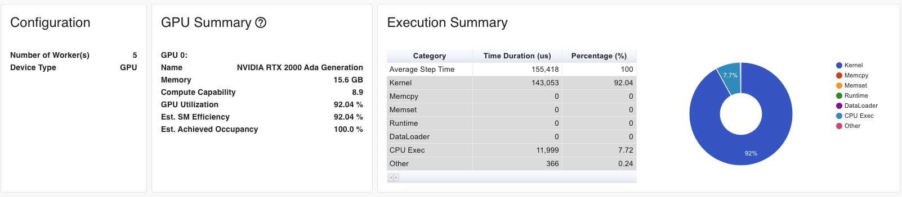
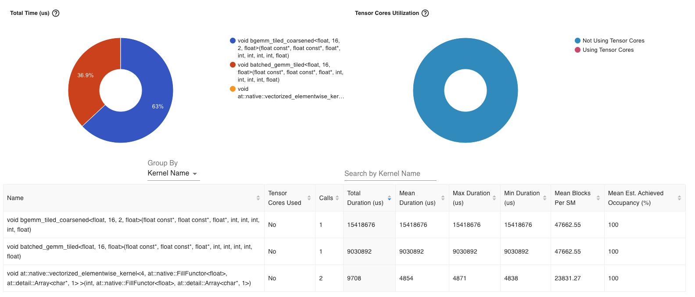

# 100daysofcuda
Learn, code, build using CUDA
All started with joining the discord:  https://discord.gg/4Tg4TkJQzE and getting inspired by everyone.

### Setup
Mentor: https://github.com/hkproj

### Instructions
Checkout: https://github.com/hkproj/100-days-of-cuda

### Why do this?
Want to be a stellar cuda programmer.

### Day 1 VECTOR ADD
Starting Day 1 with a simple kernel. Should perform VectorAdd.
Instructions to run:
```
mkdir build
cd build
cmake ..
make day_1
./day_1
```

### Day 2 GEMM
Day 2 commences with matrix multiplication, baseic version.
We are essentially taking:
```
    for (int row = 0; row < M; ++row) {
        for (int col = 0; col < N; ++col) {
            float p_value = 0.0f;
            for (int i = 0; i < K; ++i) {
                p_value += a[row * K + i] * b[i * N + col];
            }
            c[row * N + col] = p_value;
        }
    }
```
and utilizing the SIMT architecture of GPUs to parallelize it. The outer loops essentially get scheduled across the SMs and everything else in the basic version remains the same.

Instructions to run:
```
mkdir build
cd build
cmake ..
make day_2
./day_2
```
### Day 3 TILED GEMM


<p align="center">Source: <a href="https://github.com/Dao-AILab/flash-attention">Dao-AILab / FlashAttention</a></p>

As seen from the figure SRAM throughput is > 10x HBM. Let's see if we can put this to good use or not. We'll not code Flash Attention as of yet, the figure explains very clearly the difference in throughput of SRAM vs HBM and that's why I used it.

On day 3 we give Tiled GEMM a refresher. In a nutshell we want to perform multiple floating point ops on a particular chunk of data that we transferred in shared memory from HBM and maximize data re-use.

1. Load a tile of matrix A and B from global memory into shared memory
2.	Perform multiple floating-point operations (FLOPs) using this shared memory data, maximizing reuse.
3.	Load the next tile and repeat until the full matrix multiplication is done.

This minimizes global memory accesses and maximizes arithmetic intensity (FLOPs per byte transferred).
Note: If a TILE_WIDTH × TILE_WIDTH tile is loaded, it gets used TILE_WIDTH times before we move to the next tile.
```
mkdir build
cd build
cmake ..
make day_3
./day_3
```

## Day 5 Softmax Kernel
Softmax basic kernel
The basic kernel works and is correct. We don't need to profile it to come to a conclusion that it is slow, reading the kernel should lay out the memory access patterns.
* Needs to be tiled. It is memory bound at this point, we're reading too much from HBM
* The cpu kernel could use OpenMP, couldn't add it to the build system, will figure it out.
* GPU kernel makes an assumption that rows >> cols, which may not be the case, actually, it isn't as Batch size is always << hidden dims.
* Need to extend it to 3D Tensors of Shape: (B, L, D)


## Day 5 Extending Softmax Kernel
Tiled version
* Observed that numerical precision of basic kernel is better compared tiled version (possibly due to reductions in tiled version?)
* Also observed minimal speed differences between the two kernels.
* Lack of speed needs investigation and perhaps better test cases.

## Day 6 Debugging Softmax Tiled Kernel
* row sum and row max match the cpu version.
* ~something is wrong with the way I am storing exp_vals. They don't match cpu softmax.~
    * No need to use exp_vals, will tackle this in may be the online version.  
* ~also rescaling could be an issue.~
    * This is only valid for online version.
 
## Day 7 Online Softmax
This is very close to what is done in FlashAttention paper.
But we'll build it step by step. 
Few things to note: 
* Online softmax is not a magic pill or one size fits all. It's needed in specific scenarios. 
    * If matrix size is smallish like 8192 x 8192 then we have a batch size: 8192 and hidden size 8192. 
    * The naive version might end up being faster as online version has branching and we might see divergence.
* The online version is exploting the property that $e^{a + b} = e^{a} \cdot e^{b}$.
* We calculate the norm and max in one pass but we also need to perform rescaling of the norm. Let's see why:
        
`x = [1, 3, 4, 2]`, at index `0`, the value `1` is max, so we could just do:

$$
\text{max} = max_{i} 
$$
$$
\text{norm} = e^{(x_{i} - \text{max})} = e^{(1 - 1)}
$$

At index `1`, $\text{max}$ becomes `3`. The value of the global maximum $\text{max}$ has changed, so the previously calculated $\text{norm}$ needs to be updated.

We could re-write:

$$
e^{(x_{i} - \text{max})} = e^{(x_{i} - max_{i})} \cdot e^{(max_{i} - \text{max})}
$$

The quantity $e^{(max_{i} - \text{max})}$ becomes the **rescaling factor**.  
In the example above, at index `1$, we update the norm as:

```cpp
norm *= exp(1 - 3)
```
We then add to $\text{norm}$ the exponentiated value:
```cpp
norm += exp(x[i] - max)
```

* The kernel runtimes are as follows:
```
💾 Memory Allocation on Device        :  0.638    ms
💾 Mem copy (cudaMemcpyHostToDevice)  :  88.360   ms
🚀 Kernel execution time              :  95.489   ms
🚀 Online Kernel execution time       :  91.670   ms
🚀 Kernel execution time              :  94.027   ms
🚀 Online Kernel execution time       :  89.229   ms
💾 Mem copy (cudaMemcpyDeviceToHost)  :  106.156  ms
✅ Test Passed! CPU and GPU outputs match.
```

## Day 8 Batched softmax
We are still on softmax, one might wonder why softmax and why so much time on softmax. Softmax offers an opprtunity to go tiled, has reduction operations and has an online version. So far we've done tiled, online and naive. We wanted to do batched version to take a step closer to implementing self attention and flash attention. By introducing a batched dimension, we are able to see clear benefits of online softmax. In self attention, the input is of shape: (B, L, D) which we transform to (B, L, h, d) -> (B, h, L, d) -> scale(Q)K ->  Softmax(scale(Q)K). Softmax is usually applied on shape: (B, h, L, L). When B is higher and h is decently higher and L is large, we need online softmax. We've implemented this as:

```cpp
    int row = threadIdx.x + blockIdx.x * blockDim.x;
    if (row >= B * L) return; 

    int batch_idx = row / L;
    int seq_idx = row % L;
```
We launch `B*L` threads per block and each thread operates on D dimensions. Although this can be improved and is the topic for tomorrow but we clearly see online softmax winning in perf time compared to offline.

Some numbers on `NVIDIA RTX 2000`
```
Mesuring performance characteristics of online vs offline softmax
💾 Memory Allocation on Device        :  0.899    ms
💾 Mem copy (cudaMemcpyHostToDevice)  :  318.910  ms
🚀 Kernel execution time              :  244.755  ms
🚀 Online Kernel execution time       :  206.970  ms
🚀 Kernel execution time              :  250.438  ms
🚀 Online Kernel execution time       :  206.711  ms
💾 Mem copy (cudaMemcpyDeviceToHost)  :  325.269  ms
```

There's a difference of 44 ms between the two kernels, with online version faster than the offline one by ~44 ms or online version is 17.46% faster.

## Day 9 Tensor Transpose using metadata
Made a transpose function inspired by PyTorch to only change metadata. No data movement needed for now.
transpose works both on host and device as both `__host__` and `__device__` have been added to the function signature.
```
cmake ..
make day_9
...
...
./day_9
output:
Old Shape: 2 4 3 2 
Old Strides: 24 6 2 1 
New Shape: 4 2 2 3 
New Strides: 6 24 1 2 
```
## Day 10 Self Attention
Based on the previous work, utilized tiled matmul, transpose and batched online softmax to sticth together a self attention kernel.
It is decent, but in order to test it, I'd have to make sure I build python extensions now, as testing gets harder in C++ land with these extensive kernels.

Some logical next steps for the next few days:
* Fuse Transpose, GEMM, online softmax and the final GEMM
* Online softmax could be tiled.
* Using Warp Level Reductions.
* Using Tensor Cores.
* Extend it to run on longer sequences.

It's best to iterate on the base kernels by virtue of self attention kernel.

## Day 11 PyTorch Integration and Benchmarking
* Templatized the GEMM tiled kernel
* Added batched version of GEMM tiled kernel
    * We pass in batch_size in the z dimension of the gridDim, it is accessible as blockDim.z
    * We let each batch run in parallel, all we do is reach the right batch location and run GEMM_TILED on it
* PyTorch integration is added
* Profiling using PyTorch profiler is added
* Benchmarking results for `bmm`
```
-------------------------------------------------------  ------------  ------------  ------------  ------------  ------------  ------------  ------------  ------------  ------------  ------------  ------------  
                                                   Name    Self CPU %      Self CPU   CPU total %     CPU total  CPU time avg     Self CUDA   Self CUDA %    CUDA total  CUDA time avg    # of Calls  Total MFLOPs  
-------------------------------------------------------  ------------  ------------  ------------  ------------  ------------  ------------  ------------  ------------  ------------  ------------  ------------  
                                             custom_bmm         0.00%       0.000us         0.00%       0.000us       0.000us     586.641us        87.24%     586.641us     586.641us             1            --  
void batched_gemm_tiled<float, 16, float>(float cons...         0.00%       0.000us         0.00%       0.000us       0.000us     566.610us        84.26%     566.610us     566.610us             1            --  
                                              torch_bmm         2.18%      83.562us         4.45%     170.425us     170.425us       0.000us         0.00%     101.790us     101.790us             1            --  
                                              aten::bmm         1.88%      71.962us         2.27%      86.863us      86.863us     101.790us        15.14%     101.790us     101.790us             1       536.871  
                                ampere_sgemm_128x128_nn         0.00%       0.000us         0.00%       0.000us       0.000us     101.790us        15.14%     101.790us     101.790us             1            --  
                                              torch_bmm         0.00%       0.000us         0.00%       0.000us       0.000us     101.790us        15.14%     101.790us     101.790us             1            --  
                                             custom_bmm         7.95%     304.378us        95.44%       3.654ms       3.654ms       0.000us         0.00%       4.032us       4.032us             1            --  
                                            aten::zeros         1.59%      60.902us        72.41%       2.772ms       2.772ms       0.000us         0.00%       4.032us       4.032us             1            --  
                                            aten::zero_         0.46%      17.570us         2.13%      81.572us      81.572us       0.000us         0.00%       4.032us       4.032us             1            --  
                                            aten::fill_         0.66%      25.181us         1.67%      64.002us      64.002us       4.032us         0.60%       4.032us       4.032us             1            --  
-------------------------------------------------------  ------------  ------------  ------------  ------------  ------------  ------------  ------------  ------------  ------------  ------------  ------------  
Self CPU time total: 3.829ms
Self CUDA time total: 672.432us
```
PyTorch uses CUBLASS and there are a ton of optimization we could perform in the GEMM kernel, right now it runs 5x slower. it won't reach the performance of PyTorch's BMM but the aim would be to bring it closer. Before that though, the full integrated self attention kernel needs to be run.

## Day 12 Peak into CublasLt
* Benchmarked cublasLtMatmul against torch::bmm
* cublasLtMatmul requires a very detailed setup and one needs to be thorough
* Reason for picking this exercise was to see if there's anything special that PyTorch does for GEMM
    * The solution is to use cublasLtMatmul
* Below are the results
```
-------------------------------------------------------  ------------  ------------  ------------  ------------  ------------  ------------  ------------  ------------  ------------  ------------  ------------  
                                                   Name    Self CPU %      Self CPU   CPU total %     CPU total  CPU time avg     Self CUDA   Self CUDA %    CUDA total  CUDA time avg    # of Calls  Total MFLOPs  
-------------------------------------------------------  ------------  ------------  ------------  ------------  ------------  ------------  ------------  ------------  ------------  ------------  ------------  
                                ampere_sgemm_128x128_nn         0.00%       0.000us         0.00%       0.000us       0.000us     204.859us        98.03%     204.859us     102.429us             2            --  
                                          cublaslt_gemm         0.00%       0.000us         0.00%       0.000us       0.000us     106.620us        51.02%     106.620us      53.310us             2            --  
                                              torch_bmm         1.30%      52.282us         4.97%     200.606us     200.606us       0.000us         0.00%     102.366us     102.366us             1            --  
                                           aten::matmul         1.07%      43.081us         3.68%     148.324us     148.324us       0.000us         0.00%     102.366us     102.366us             1            --  
                                              aten::bmm         1.31%      52.711us         1.62%      65.372us      65.372us     102.366us        48.98%     102.366us     102.366us             1       536.871  
                                              torch_bmm         0.00%       0.000us         0.00%       0.000us       0.000us     102.366us        48.98%     102.366us     102.366us             1            --  
                                          cublaslt_gemm         8.97%     361.761us        94.91%       3.828ms       3.828ms       0.000us         0.00%       4.127us       4.127us             1            --  
                                            aten::zeros         1.60%      64.331us        69.67%       2.810ms       2.810ms       0.000us         0.00%       4.127us       4.127us             1            --  
                                            aten::zero_         0.46%      18.420us         2.04%      82.222us      82.222us       0.000us         0.00%       4.127us       4.127us             1            --  
                                            aten::fill_         0.62%      25.151us         1.58%      63.802us      63.802us       4.127us         1.97%       4.127us       4.127us             1            --  
-------------------------------------------------------  ------------  ------------  ------------  ------------  ------------  ------------  ------------  ------------  ------------  ------------  ------------  
Self CPU time total: 4.033ms
Self CUDA time total: 208.986us
```
Overall we do fine, there's a slight difference of `4 microseconds` or `~2%`, we'll look into it at some point.

## Day 13 Thread Coarsening
Added Thread coarsened GEMM tiled version and tested it with a coarsening factor of 2 and 4.
Observations:
* Coarsening ended up affecting the performance adversely.
* Hooked up pytorch profiler with TB and visualized the metrics.


GPU Kernel breakdown


## Day 14 Atomic sum
We code 1D atomic sum today. I have to travel, so we'll keep things simple (but not too simple!).
In 1D Add we are exercising reduction pattern but we do it in an optimized way. 
We write a strided for loop and Within a block we're summing the elements that are stride distance away. The way to construct strides governs if we'll be able to minimize thread divergence or not. So, in out code we do the following:
```cpp
for(int stride = blockDim.x / 2; stride > 0; stride /= 2) {
    ...
}
```
Here first thing to note is that we're starting at `blockDim.x / 2` location. So, half of the threads will be inactive as each thread adds up two elements that are stride distance away. Thread `0` will sum element at index `0` and at index `blockDim.x / 2`. This way of adding elements results in less thread divergence (which only shows up when stride becomes less than the warp size) and for most part (only in the final iteration when computation load is smaller we see some divergence) all threads in a warp follow same execution path).

After the first loop has ended:
```cpp
for(int stride = blockDim.x / 2 ; stride > 0; stride /= 2) {
        if (tx < stride ) {
            smem[tx] += smem[tx + stride];
        }
        __syncthreads();
}
```
Once the block-wise sum is computed (each block reducing its portion of the array), the first thread (thread 0) performs an `atomicAdd` to update the global result. Finally, we validate our implementation by comparing it against PyTorch’s sum function.

## Day 15 Layer Norm
Finally, get to code `LayerNorm`, all pieces for a `Transformer` block (well, `RMSNorm` is similar inspirit) are coming together. We implement LayerNorm which expects a `2D` input tensor of `Shape: (N, D)`. The algorithm works as follows:
Each row is operated on per block. The number of elements `D` 
could be larger than the block size or the number of threads in a block
so naturally, each thread operates on multiple elements to calculate the mean and variance.
We go strided, start with `idx = threadIdx.x` (of current thread) and go until we can (idx < D)
with a stride of `blockDim.x`

We need to fetch the row for a block, the indexing for input and output is the same.
```cpp
block_input = input + blockIdx.x * D;
block_output = input + blockIdx.x * D;
```
We fetch `x = block_input[idx]` and add it to sum and sum_squared.

We then in shared memory add the work done by each thread.
After a barrier sync, we do parallel reduction using a strided pattern we saw before.
Thread 0 of each block is responsible for calculating the final mean and inverse std dev
for a row.

Then we do the layer norm op:
```cpp
norm = (x - mean) * inv_std;
output = norm * gamma[idx] + beta[idx].
```
We will allocate `gammas`, `betas` and `output` on kernel launch.

PyTorch run:
```
(cuda) ➜  day_15 git:(main) ✗ python profile_ln.py         
Results match: True
-------------------------------------------------------  ------------  ------------  ------------  ------------  ------------  ------------  ------------  ------------  ------------  ------------  ------------  ------------  ------------  ------------  
                                                   Name    Self CPU %      Self CPU   CPU total %     CPU total  CPU time avg     Self CUDA   Self CUDA %    CUDA total  CUDA time avg       CPU Mem  Self CPU Mem      CUDA Mem  Self CUDA Mem    # of Calls  
-------------------------------------------------------  ------------  ------------  ------------  ------------  ------------  ------------  ------------  ------------  ------------  ------------  ------------  ------------  ------------  ------------  
                                       torch layer norm         2.46%     106.083us        38.01%       1.637ms       1.637ms       0.000us         0.00%     321.083us     321.083us           0 b           0 b      32.00 Mb           0 b             1  
                                       aten::layer_norm         0.47%      20.171us        29.76%       1.281ms       1.281ms       0.000us         0.00%     321.083us     321.083us           0 b           0 b      32.00 Mb      -8.00 Kb             1  
                                aten::native_layer_norm         1.75%      75.482us        29.29%       1.261ms       1.261ms     321.083us        50.94%     321.083us     321.083us           0 b           0 b      32.01 Mb           0 b             1  
void at::native::(anonymous namespace)::vectorized_l...         0.00%       0.000us         0.00%       0.000us       0.000us     321.083us        50.94%     321.083us     321.083us           0 b           0 b           0 b           0 b             1  
                                       torch layer norm         0.00%       0.000us         0.00%       0.000us       0.000us     321.083us        50.94%     321.083us     321.083us           0 b           0 b           0 b           0 b             1  
void layer_norm<float>(float const*, float*, float c...         0.00%       0.000us         0.00%       0.000us       0.000us     309.242us        49.06%     309.242us     309.242us           0 b           0 b           0 b           0 b             1  
                                      custom_layer norm         0.00%       0.000us         0.00%       0.000us       0.000us     309.242us        49.06%     309.242us     309.242us           0 b           0 b           0 b           0 b             1  
                                      custom_layer norm         7.38%     317.671us        61.95%       2.667ms       2.667ms       0.000us         0.00%       0.000us       0.000us           0 b           0 b      32.00 Mb           0 b             1  
                                       aten::empty_like         0.75%      32.211us        44.82%       1.930ms       1.930ms       0.000us         0.00%       0.000us       0.000us           0 b           0 b      32.00 Mb           0 b             1  
                                    aten::empty_strided        39.77%       1.712ms        44.07%       1.898ms       1.898ms       0.000us         0.00%       0.000us       0.000us           0 b           0 b      32.00 Mb      32.00 Mb             1  
-------------------------------------------------------  ------------  ------------  ------------  ------------  ------------  ------------  ------------  ------------  ------------  ------------  ------------  ------------  ------------  ------------  
Self CPU time total: 4.305ms
Self CUDA time total: 630.325us
```
## Day 16 Layer Norm with normalized shape
Today we make the layernorm as similar as possible to PyTorch, not only in terms of performance but also in the API and usage. We now accept normalized_shape as a parameter which matches the shape of gamma and beta.

### Example
For a tensor of shape: `(B, L, D)`, the `normalized shape` could be `(L, D)`, which would mean we also make `gamma` and `beta` of the same shape.
The mean and variance are then calcuated for `(L, D)` and applied to each Sequence. This is different though from a normal Transformer Block but the lfexibility of the kernel allows for arbitrary `normalized_shapes` (usually trailling dimensions).

### Runtime
```
(cuda) ➜  day_16 git:(main) ✗ python profile_ln.py
Results match: True
-------------------------------------------------------  ------------  ------------  ------------  ------------  ------------  ------------  ------------  ------------  ------------  ------------  ------------  ------------  ------------  ------------  
                                                   Name    Self CPU %      Self CPU   CPU total %     CPU total  CPU time avg     Self CUDA   Self CUDA %    CUDA total  CUDA time avg       CPU Mem  Self CPU Mem      CUDA Mem  Self CUDA Mem    # of Calls  
-------------------------------------------------------  ------------  ------------  ------------  ------------  ------------  ------------  ------------  ------------  ------------  ------------  ------------  ------------  ------------  ------------  
                                       torch layer norm         0.91%     382.539us        55.55%      23.348ms      23.348ms       0.000us         0.00%      19.584ms      19.584ms           0 b           0 b       1.00 Gb           0 b             1  
                                       aten::layer_norm         0.05%      22.350us         8.40%       3.531ms       3.531ms       0.000us         0.00%      19.584ms      19.584ms           0 b           0 b       1.00 Gb      -1.00 Kb             1  
                                aten::native_layer_norm         4.75%       1.998ms         8.35%       3.509ms       3.509ms      19.584ms        51.78%      19.584ms      19.584ms           0 b           0 b       1.00 Gb           0 b             1  
void at::native::(anonymous namespace)::vectorized_l...         0.00%       0.000us         0.00%       0.000us       0.000us      19.584ms        51.78%      19.584ms      19.584ms           0 b           0 b           0 b           0 b             1  
                                       torch layer norm         0.00%       0.000us         0.00%       0.000us       0.000us      19.584ms        51.78%      19.584ms      19.584ms           0 b           0 b           0 b           0 b             1  
void layer_norm<float>(float const*, float*, float c...         0.00%       0.000us         0.00%       0.000us       0.000us      18.236ms        48.22%      18.236ms      18.236ms           0 b           0 b           0 b           0 b             1  
                                      custom_layer norm         0.00%       0.000us         0.00%       0.000us       0.000us      18.236ms        48.22%      18.236ms      18.236ms           0 b           0 b           0 b           0 b             1  
                                            aten::empty         0.11%      46.892us         0.98%     412.220us     137.407us       0.000us         0.00%       0.000us       0.000us           0 b           0 b       1.00 Gb       1.00 Gb             3  
                                  cudaStreamIsCapturing         0.01%       3.640us         0.01%       3.640us       1.213us       0.000us         0.00%       0.000us       0.000us           0 b           0 b           0 b           0 b             3  
                                             cudaMalloc         1.37%     575.742us         1.37%     575.742us     191.914us       0.000us         0.00%       0.000us       0.000us           0 b           0 b           0 b           0 b             3  
-------------------------------------------------------  ------------  ------------  ------------  ------------  ------------  ------------  ------------  ------------  ------------  ------------  ------------  ------------  ------------  ------------  
Self CPU time total: 42.027ms
Self CUDA time total: 37.820ms
```
## Day 17 convolution
Batched convolution for a 4D tensor shaped: `(B, C, H, W)`
I will post a detailed analysis tomorrow.

## Day 18
Debugging Report [here](https://github.com/vectorquantized/100daysofcuda/blob/main/src/day_18/debugging.md)

## Day 19
We're taking a break from conv2D today and adding AB^T fused version to build up to flash attention forward.
Here are the profiling results:
```
(cuda) ➜  day_19 git:(main) ✗ python profile_gemm_bench.py
Matrices match: True
-------------------------------------------------------  ------------  ------------  ------------  ------------  ------------  ------------  ------------  ------------  ------------  ------------  ------------  ------------  ------------  ------------  ------------  
                                                   Name    Self CPU %      Self CPU   CPU total %     CPU total  CPU time avg     Self CUDA   Self CUDA %    CUDA total  CUDA time avg       CPU Mem  Self CPU Mem      CUDA Mem  Self CUDA Mem    # of Calls  Total MFLOPs  
-------------------------------------------------------  ------------  ------------  ------------  ------------  ------------  ------------  ------------  ------------  ------------  ------------  ------------  ------------  ------------  ------------  ------------  
                             custom_bmm_transpose_fused         0.00%       0.000us         0.00%       0.000us       0.000us     808.497us       100.58%     808.497us     808.497us           0 b           0 b           0 b           0 b             1            --  
void batched_gemm_tiled_ABT<float, 16, float>(float ...         0.00%       0.000us         0.00%       0.000us       0.000us     695.123us        86.48%     695.123us     695.123us           0 b           0 b           0 b           0 b             1            --  
                                    torch_bmm_transpose         0.44%     279.689us        86.33%      54.883ms      54.883ms       0.000us         0.00%     104.446us     104.446us           0 b           0 b      10.12 Mb           0 b             1            --  
                                              aten::bmm        65.27%      41.491ms        85.81%      54.550ms      54.550ms     104.446us        12.99%     104.446us     104.446us           0 b           0 b      10.12 Mb      10.12 Mb             1       536.871  
                                ampere_sgemm_128x128_tn         0.00%       0.000us         0.00%       0.000us       0.000us     104.446us        12.99%     104.446us     104.446us           0 b           0 b           0 b           0 b             1            --  
                                    torch_bmm_transpose         0.00%       0.000us         0.00%       0.000us       0.000us     104.446us        12.99%     104.446us     104.446us           0 b           0 b           0 b           0 b             1            --  
                             custom_bmm_transpose_fused         0.56%     355.660us        13.66%       8.686ms       8.686ms       0.000us         0.00%       4.256us       4.256us           0 b           0 b       2.00 Mb           0 b             1            --  
                                            aten::zeros         0.09%      56.252us        12.04%       7.654ms       7.654ms       0.000us         0.00%       4.256us       4.256us           0 b           0 b       2.00 Mb           0 b             1            --  
                                            aten::zero_         0.04%      27.590us         9.21%       5.856ms       5.856ms       0.000us         0.00%       4.256us       4.256us           0 b           0 b           0 b           0 b             1            --  
                                            aten::fill_         0.04%      24.461us         9.17%       5.828ms       5.828ms       4.256us         0.53%       4.256us       4.256us           0 b           0 b           0 b           0 b             1            --  
-------------------------------------------------------  ------------  ------------  ------------  ------------  ------------  ------------  ------------  ------------  ------------  ------------  ------------  ------------  ------------  ------------  ------------  
Self CPU time total: 63.571ms
Self CUDA time total: 803.825us
```
Notice how PyTorch does a quick view transform for transpose on CPU, that's pretty clever! The fused kernel is of course 8x slower because we established before that PyTorch highly optimized and is using CUBLAS underneath. 