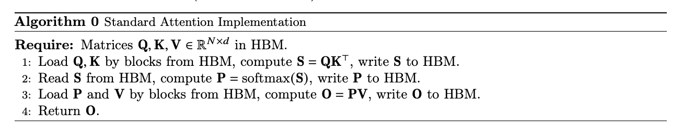
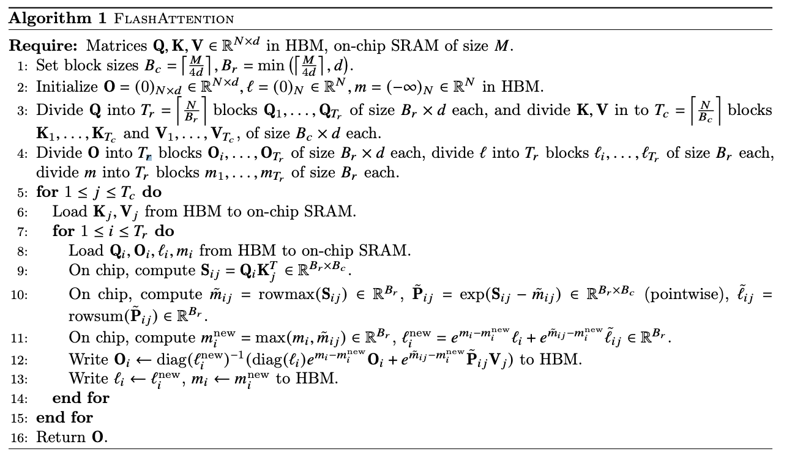

## Day 31 Flash Attention Kernel
On Day 30 we coded Flash Attention Kernel. It's pretty involved to code and get right but the algorithm is pretty simple to understand. At the heart of it lies tiled GEMM (using shared memory) between the query and transposed key matrix and the online softmax implementation that is fused into the kernel. Let's understand what's happening in Flash Attention Kernel to build up to the actual implementation.

### Multi-Head Attention (MHA)
Multi-Head Attention (MHA) is a way to compute the attention scores for each location in the query by looking at the Key and Value matrices. The implementation of MHA is pretty straightforward and the python code looks as follows:

```python
import torch
import torch.nn as nn
import torch.nn.functional as F
from einops import rearrange

class MHA(nn.Module):
    def __init__(self, cfg: AttentionConfig) -> None:
        super().__init__()
        self.cfg = cfg
        self.qkv_fused = nn.Linear(cfg.input_dim, 3 * cfg.hidden_dim, bias = False)
        self.n_heads = cfg.num_heads
        assert(cfg.hidden_dim % cfg.num_heads == 0, "Hidden dimension should be a multiple of number of heads")
        self.model_dim = cfg.hidden_dim // cfg.num_heads
        self.scale = torch.rsqrt(self.model_dim)
        self.out = nn.Linear(cfg.hidden_dim, cfg.output_dim, bias = False)

    
    def forward(self, input: torch.Tensor) -> torch.Tensor:
        """Forward pass for MHA
        
        Args:
            input: torch.Tensor of shape: (B, N, E)
        Returns:
            output torch.Tensor of shape: (B, )
        """
        qkv = self.qkv_fused(input)
        q, k, v = torch.chunk(qkv, 3, dim=-1) # Each is of shape: (B, N, D)
        q = rearrange(q, 'b n (h d) -> b h n d', h=self.n_heads)
        k = rearrange(k, 'b n (h d) -> b h n d', h=self.n_heads)
        v = rearrange(v, 'b n (h d) -> b h n d', h=self.n_heads)
        scores = (q * scale) @ k.transpose(2, 3) # shape: (B, H, N, N)
        weights = F.softmax(scores, dim=-1) # shape: (B, H, N, N)
        attention_values = weights @ v # shape: (B, H, N, D)
        attention_values = rearrange(attention_values, 'b d n d -> b n (h d)', h=self.n_heads)
        output = self.out(attention_scores)
        return output
```

This is a basic implementation of MHA in PyTorch. Given that we want to write custom CUDA kernels, we assume that we have a custom compiler written for ourselves and it converts the Python code to a CUDA kernel. Assume that the compiler is super simple and looks at each operation looks up the corresponding operation in C++ and calls the binding's wrapper which in turn calls the CUDA kernel. So, we'd then be required to have matrix multiplication and softmax implementations available to us in order to run this code on GPU. 

We'd need matmul kernel for:

```python
scores = (q * scale) @ k.transpose(2, 3) # shape: (B, H, N, N)
attention_values = weights @ v # shape: (B, H, N, D)
```
Note: We ignore the fused qkv and output linear layers for now.

We'd need the softmax kernel for:
```python
weights = F.softmax(scores, dim=-1) # shape: (B, H, N, N)
```
The algorithm looks like follows:



Standard attention implementations materialize the matrices `attention_values` $(S)$ and `weights` $(P)$ to HBM, which takes $O(N^2)$ memory, often $ N >> d $ making this kernel memory bound.

#### Flash Attention

##### Introduction

To address the above issues [FlashAttention: Fast and Memory-Efficient Exact Attention with IO-Awareness](https://arxiv.org/pdf/2205.14135) introduces an efficient way of implementing the kernel which makes the kernel compute bound. Let's see how:

First let's discuss online softmax, on day 7 we implemented online softmax, but let's just revisit it. We exploit $e^{a + b} = e^{a} \cdot e^{b}$ property of the exponential function. The basic idea is that we keep a running value of max and norm, if the value of max changes (that is, we encounter a greater value than the current max) then we change the max and rescale the norm. The value by which we rescale the norm is given by: $e^{(max_{i} - \text{max})}$, as:

$$
e^{(x_{i} - \text{max})} = e^{(x_{i} - max_{i})} \cdot e^{(max_{i} - \text{max})}
$$

The authors then propose a fused version (enabled due to tiling) and note that:

*"Tiling enables us to implement our algorithm in one CUDA kernel, loading input from HBM, performing all the computation steps (matrix multiply, softmax optionally masking and dropout, matrix multiply), then write the result back to HBM (masking and dropout in Appendix B). This avoids repeatedly reading and writing of inputs and outputs from and to HBM."*

The outline of the algorithm looks as follows:



##### Kernel Design spec

Inorder to implement this kernel, we'd need a way to load the blocks of Q, K and V matrices in the shared memory then compute their dot product, apply softmax and compute dot product with value block. So, let's see the functions that we could implement:

* `load_qkv_blocks` will load $Q$, $K$ and $V$ in shared memory by block.
* `compute_dot_product` will compute $QK^T$
* A function that computes online softmax, `update_softmax_state`
Note that we perform the softmax statistics update and multiplication with V in one go as follows:

```cpp
T scale_prev = exp(m_prev - m_new) / l_new;
T scale_new = exp(qk - m_new) / l_new;
o_prev[d] = o_prev[d] * scale_prev + v_row[d] * scale_new;
```

###### Load the Q, K, V Blocks in shared memory
Let's look at the function , its signature is as follows:
```cpp
template<typename T, int BLOCK_SIZE_M, int BLOCK_SIZE_N, int D_VALUE>
__device__ void load_qkv_blocks(
   const T* __restrict__ Q,
   const T* __restrict__ K,
   const T* __restrict__ V,
   T s_Q[BLOCK_SIZE_M][D_VALUE],
   T s_K[BLOCK_SIZE_N][D_VALUE],
   T s_V[BLOCK_SIZE_N][D_VALUE],
   const host::AttentionContext<T>& ctx,
   BlockIndices& indices
)
```
We've templatized our implementation. We pass in the `Q`, `K` and `V` arrays and we also pass in the 2D arrays in shared memory. There's an additional `AttentionContext` variable that is passed that contains metadata such as `B`, `H`, `N`, `D`, `scale` and `is_causal`. BlockIndices encapculate:
```cpp
    int batch_idx;       // Current batch
    int head_idx;        // Current attention head
    int row_block_idx;   // Block index for query rows
    int col_block_idx;   // Block index for key/value columns
    int tid;             // Thread ID within block
    int valid_rows;      // Number of valid rows in current block
    int valid_cols;      // Number of valid columns in current block
    int row_start;       // Starting row index for current block
    int col_start;       // Starting column index for current block
```
We then calculate the valid rows and valid cols as follows:

```cpp
    // Get number of valid rows/cols in current blocks (handle boundary)
   indices.valid_rows = min(BLOCK_SIZE_M, ctx.N - indices.row_start);
   indices.valid_cols = min(BLOCK_SIZE_N, ctx.N - indices.col_start);
```
We load a block of `Q`, `K` and `V` based on the values of `valid_rows` (for `Q`) and `valid_cols` (for `K` and `V`).
The loading is done as follows for `Q` (Note that we're loading rows of Q):

```cpp
// Load Q block to shared memory (each thread loads multiple elements)
   for (int row_offset = 0; row_offset < indices.valid_rows; row_offset += blockDim.x / D_VALUE) {
       int row_idx = row_offset + indices.tid / D_VALUE;
       if (row_idx < indices.valid_rows) {
           int col_idx = indices.tid % D_VALUE;
           int q_pos = batch_head_offset + (indices.row_start + row_idx) * ctx.D + col_idx;
           s_Q[row_idx][col_idx] = Q[q_pos];
       }
   }
```
The `row_idx` is `row_offset + threadIdx.x / D_VALUE`, so `row_idx` will be the same for all threads with `threadIdx.x < D_VALUE`, `col_idx` would be the value of `threadIdx.x` when `threadIdx.x < D_VALUE`. So, after the loop has finished we'd have a block of `Q` of shape: $B_r \times d$ loaded in shared memory.

We'd load the corresponding columns of `K`:

```cpp
// Load K block to shared memory
   for (int col_offset = 0; col_offset < indices.valid_cols; col_offset += blockDim.x / D_VALUE) {
       int col_idx = col_offset + indices.tid / D_VALUE;
       if (col_idx < indices.valid_cols) {
           int d_idx = indices.tid % D_VALUE;
           int k_pos = batch_head_offset + (indices.col_start + col_idx) * ctx.D + d_idx;
           s_K[col_idx][d_idx] = K[k_pos];
       }
   }
```

We do the same for V. The observation here is that for the $QK^T$ computation:

* `Q` is on the "left side" (providing rows)
* `K` is on the "right side" (providing columns due to the transpose)
* We need to load blocks of Q horizontally and blocks of K vertically
* We do the same for `V` as `V` shows up on the right side of the GEMM computation: $softmax(QK^T) × V$.
    * The attention weights are applied to V
    * `V` needs to align with K on the sequence dimension

So `V` blocks are loaded in the same pattern as `K` blocks.
