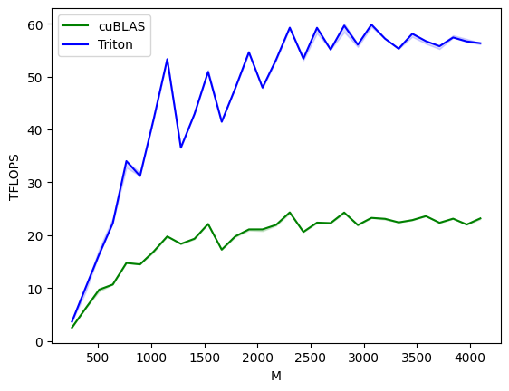

## Day 42 Grouped GEMM using Triton
First we note that triton jit'ed functions can be auto-tuned. We create a few autotune configs which will allow us to do a search on the values of `BLOCK_SIZE_M`, `BLOCK_SIZE_N`, `BLOCK_SIZE_K`, `GROUP_SIZE_M` and `num_stages`.
Example config:
```python
triton.Config({'BLOCK_SIZE_M': 128, 'BLOCK_SIZE_N': 256, 'BLOCK_SIZE_K': 64, 'GROUP_SIZE_M': 8}, num_stages=3,
                      num_warps=8),
```
We then declare our kernel as follows:
```python
@triton.autotune(
    configs=get_cuda_autotune_config(),
    key=['M', 'N', 'K'],
)
@triton.jit
def matmul_kernel(a_ptr: torch.Tensor, b_ptr: torch.Tensor, c_ptr: torch.Tensor,
                  M: int, N: int, K: int, stride_am: int, 
                  stride_ak: int, stride_bk: int, stride_bn: int,
                  stride_cm: int, stride_cn: int,
                  BLOCK_SIZE_M: tl.constexpr, BLOCK_SIZE_N: tl.constexpr,
                  BLOCK_SIZE_K: tl.constexpr, GROUP_SIZE_M: tl.constexpr,
                  ACTIVATION: tl.constexpr):
```
The key in the `@triton.autotune` decorator mean that whenever the value of this key changes it will trigger evaluation of all the provided configs.

We then go on to the kernel's implementation define a few variables:
```python
pid = tl.program_id(0)
num_pid_m = tl.cdiv(M, BLOCK_SIZE_M) # Number of programs to process blocks of size M
num_pid_n = tl.cdiv(N, BLOCK_SIZE_N) # Number of programs to process blocks of size N
# Number of programs/threads to process a group. Each group processes a tile of size: 
# GROUP_SIZE_M (rows) × BLOCK_SIZE_N (columns)
num_pid_in_group = GROUP_SIZE_M * num_pid_n
```

If `GROUP_SIZE_M = 1`, we have a straight forward case where `num_pid_in_group = num_pid_n`, we have a grid of `num_pid_m x num_pid_n` programs which will produce the output. We then calculate `group_id` and `first_pid_m` as follows:

```python
group_id = pid // num_pid_in_group
first_pid_m = group_id * GROUP_SIZE_M
```
We need `group_id` to jump over groups of rows. `first_pid_m` helps us to calculate the offsets for the rows of `a`. We then move on to the most important bit of optimization that helps us come close and even beat cuBLAS's implementation:
```python
pid_m = first_pid_m + ((pid % num_pid_in_group) % group_size_m)
pid_n = (pid % num_pid_in_group) // group_size_m
offs_am = (pid_m * BLOCK_SIZE_M + tl.arange(0, BLOCK_SIZE_M)) % M
offs_bn =  (pid_n * BLOCK_SIZE_N + tl.arange(0, BLOCK_SIZE_N)) % N
offs_k = tl.arange(0, BLOCK_SIZE_K)
```
`pid_m` will give us the program id for the rows. We first reach the group we're processing using `first_pid_m` and then add to it thr group it belongs to and from within that group we fetch the row it belongs to, which is given by `(pid % num_pid_in_group) % group_size_m` as `num_pid_in_group = GROUP_SIZE_M * num_pid_n`. Example:

```
BLOCK_SIZE_M = BLOCK_SIZE_N = 2
M = 8
K = 6
N = 8
num_pid_m = num_pid_n = 4
pid = 15,
GROUP_SIZE_M = 2
num_pid_in_group = 2 * 4 = 8
group_id = 15 // 8 = 1
first_pid_m = 1 * 2 = 2
pid_m = 2 + ((15 % 8) % 2) = 2 + (7 % 2) = 2 + 1 = 3
pid_n = (15 % 8) // 2 = 7 // 2 = 3
```

`pid = 15` will map to `pid_m = 3, pid_n = 3`, The threads are mapped to `pid_m * BLOCK_SIZE - (pid_m + 1) * BLOCK_SIZE - 1` rows and similary for columns. In our example, the threads will calculate rows: `[3 * 2, 4 * 2 - 1] = [6,7]` and columns: `[6,7]` of the output, the last block of `2x2` numbers.

And to generate offsets we do: `[6] + [0, 1]` for rows and `[6] + [0, 1]` columns. We then load those numbers using:
```python
a_ptrs = a_ptr + offs_am[:, None] * stride_am + offs_k[None, :] * stride_ak
b_ptrs = b_ptr + offs_k[:, None] * stride_bk + offs_bn[None, :] * stride_bn
```

After this we just advance the pointers to load next block of numbers along the `K` dimension. 

### Results of Benchmarking.
After adding L2 cache optimizations and auto-tuning the kernel, we observe:


